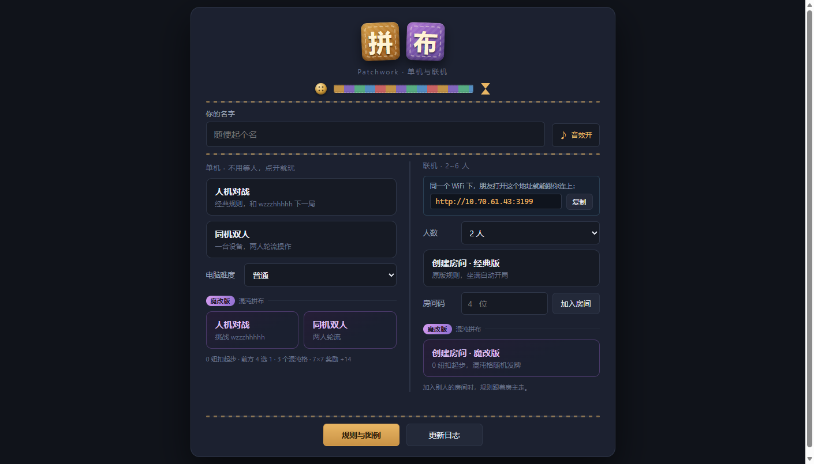
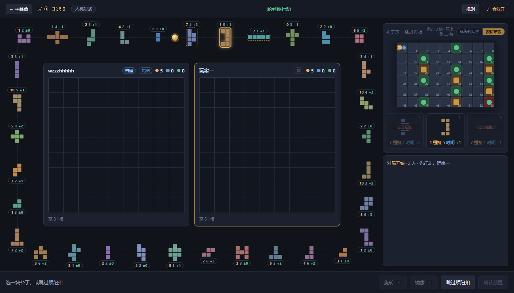
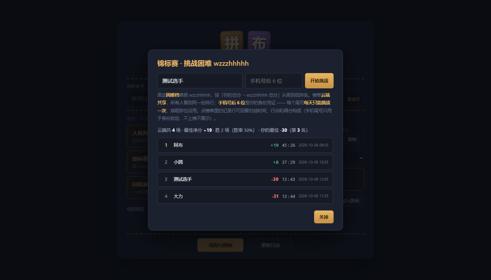
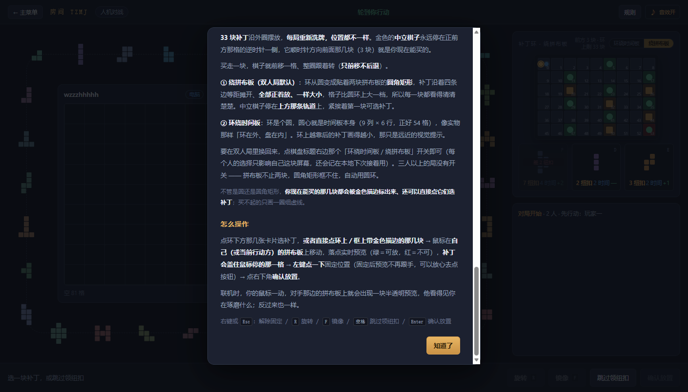

# 拼布 Patchwork · 单机与联机 v1.7.1

原版规则完整实现的网页版拼布（Uwe Rosenberg / Lookout Games 2014）。
**四种玩法**：人机对战、锦标赛、同机双人、2~6 人联机。
**人机三档难度**：轻松 / 普通 / 困难（困难最多看六层、会算未来，实测对「普通」胜率 80%，名字旁边直接写着难度）。
**零依赖**：只用 Node 内置模块，不需要 `npm install`，不怕校园网装不上包；音效也是现场合成，不带任何音频文件。

<p align="center">
  
  
</p>
<p align="center">
  
  
</p>

> **想点开就玩、不想装东西？** 有[在线版](https://patchwork-online.app.workbuddy.host/) ——
> 纯静态单机版（人机对战 + 同机双人），主菜单底部还会显示「有多少人玩过」的实时统计。
> 联机必须跑本地服务，见下面三步。

---

## 想直接玩？三步

1. 点右上角绿色的 **Code → Download ZIP**（或者 `git clone https://github.com/PineappleZero/patchwork-online.git`）；
2. 解压，装好 [Node.js](https://nodejs.org/)（18 以上都行）；
3. 双击目录里的 **`启动联机服务.bat`** —— 黑窗口会吐出两个地址，浏览器打开「本机」那条。

不用 `npm install`，这个项目零依赖。想和朋友一起玩，就把黑窗口里「给朋友」那条局域网地址
和 4 位房间码发给他，**同一个 WiFi** 下打开就能进来（详见下面的「朋友打不开怎么办」）。

> **版本**：每个发布版都打了 tag（`v1.0` → `v1.7.1`，共 17 个），想看某一版点 tag 就行。
> **编号是连续的**：1.0 → 1.1 → 1.2 → 1.3 → 1.4 → 1.4.1 → 1.5 → 1.5.1 → 1.6 → 1.6.1 → 1.6.2 → 1.6.3 → 1.6.4 → 1.6.5 → 1.6.6 → 1.6.7 → 1.7 → 1.7.1。
> 其中 `v1.1` **没有独立源码** —— 归档流程是做到 v1.2 才建起来的，1.1 当时直接在 1.0 的目录里改，
> 随后被 1.2 原地覆盖，翻遍 reflog 和 `git fsck --lost-found` 都找不回来了。
> 它当时的改动都已包含在 v1.2 及之后的所有版本里，功能上没有缺失。

---

## 怎么开局

双击 `启动联机服务.bat`。会弹出一个黑窗口，上面显示两个地址，例如：

```
拼布 Patchwork 联机服务已启动
============================================
你自己（本机）：  http://localhost:3178
给朋友（局域网）：http://192.168.1.23:3178   [WLAN]
============================================
```

用「本机」地址打开页面，会看到**主菜单**，三种玩法都在这里选：

标题「拼布」两个字本身就是两块**布片**（斜纹布底 + 一圈虚线缝脚），下面一条五色拼布带配一颗纽扣和一只砂漏，
全是纯 CSS 画的。菜单用**粗线**切成几块：标题 / 你的名字 / 玩法 / 底部按钮。

主菜单分左右两栏：**左边单机、右边联机**。

| 入口 | 说明 |
|---|---|
| **人机对战** | 和内置电脑单挑，点一下就开局，不用等人。可选「轻松 / 普通 / 困难」难度。 |
| **锦标赛 · 挑战困难** | 昵称 + 手机尾号参赛，固定打困难档 wzzzhhhhh；**云端共享榜单**（所有玩家同一份排行，净分从高到低），每个尾号每天只能挑战一次；点记录行能回看每局的行动与得分构成。 |
| **同机双人** | 一台设备两人轮流操作，轮到谁界面就切到谁。 |
| **创建房间 · 经典版** | 先选人数（2~6），点一下拿到 4 位房间码。 |
| **加入房间** | 填 4 位房间码进别人开的房。 |

底部正中间那个金色按钮是 **规则与图例**，主菜单和对局顶栏的「规则」打开的是**同一个弹层**：
从「一分钟看懂」讲起（这是个什么比赛、钱和步数怎么权衡、怎么算赢），
再到落点预览、数值签图例、三种环绕方式与每一步操作 —— **小白不查任何资料也能看懂开打**。

右上角那个 **♪ 音效开关** 主菜单和对局页各有一个，**在每个界面都能开关**，两处永远同步，
选择记在本地，下次打开还是上次的样子。

**联机怎么叫朋友进来**：主菜单的联机区**直接显示**那条「给朋友」的局域网地址（旁边有「复制」按钮），
把它和 4 位房间码一起发给朋友即可 —— 不用再去黑窗口里找。
朋友连同一个 WiFi，用浏览器打开地址 → 在主菜单填房间码 → 点「加入房间」。

- 人**坐满**会自动开局；房主也可以不等坐满，在等待房里点「开始对局」提前开始。
- 黑窗口一关，服务就停了。对局中别关。

### 关于编码（改 bat 时必看）

`启动联机服务.bat` 里**没有任何中文**，这是刻意的：

- cmd.exe 会按**当前代码页**逐行解析 bat 文件。如果文件是 UTF-8 存的中文，会被按 GBK 拆错，报一堆 `'xxx' 不是内部或外部命令`，然后整个脚本崩掉。
- 脚本第一行执行 `chcp 65001` 把控制台切成 UTF-8。**这之后文件里的 GBK 中文反而会乱码**，所以 chcp 之后不能再出现中文。
- 结论：bat 只写 ASCII，所有中文提示都交给 `server/index.js` 打印（Node 侧会自己确保控制台是 UTF-8）。改这个 bat 时请保持纯 ASCII。

### 朋友打不开怎么办

1. **确认同一个 WiFi**：手机热点、宿舍路由器都行，但必须同一网段。校园网常在客户端之间做隔离，这种情况最容易失败。
2. **Windows 防火墙**：第一次启动时系统会弹「是否允许 Node.js 访问网络」，勾选**专用网络**并允许。如果当时点了取消，去「Windows 安全中心 → 防火墙和网络保护 → 允许应用通过防火墙」里把 Node.js 的两个勾都打上。
3. **换地址试**：如果电脑有多个网卡（有线 + 无线 + 虚拟机），黑窗口会列出多条，逐条发给朋友试。
4. 手机浏览器也能玩，页面在窄屏下会自动变成单列布局。

---

## 玩法要点

| 项目 | 说明 |
|---|---|
| 棋盘 | 9×9 拼布板，每人一块（人数多时拼布板自动缩小排成网格，一屏看得全） |
| 补丁 | 33 块多格补丁 + 5 块 1×1 皮革补丁（后者的获取方式见下） |
| **补丁环** | 33 块补丁沿环摆放，**每局重新洗牌，位置都不一样**；中立棋子正前方 3 块为当前可买，**会被金色描边标出来、还能直接点**，每块旁边都挂着价格小签（金＝纽扣 / 蓝＝时间 / 绿＝收入） |
| 时间板 | 54 格（0 ~ 53），53 为终点中央格 |
| **环绕方式** | **绕拼布板**（双人局默认，圆角矩形贴着两块拼布板）／**环绕时间板**（圆，时间板坐在环心）。切换开关在棋盘标题右边，只影响自己这块屏幕 |
| 起始纽扣 | 每人 5 个 |
| 7×7 奖励 | **全场只有一块奖励牌**，先拼出完整无洞的 7×7 方块者 +7 分，之后谁再拼出来也没有加分 |
| 终局计分 | 手中纽扣 + 7×7 奖励 − 每格空格 2 分 |
| 平局 | 同分时先抵达终点者获胜 |

**回合顺序**：时间板上**最落后的一方**行动，只要你还没超过别人就继续轮到你，所以同一个人可能连走好几步。
几个人停在同一格时，**后到达**的那个先动（时间板上他就是带金边的那一枚）。

- **行动 A · 跳过领纽扣**：把时间令牌走到**你前面最近那位玩家**的前方一格，每走一格领 1 个纽扣。
  两人局时那位就是你的对手。**如果你已经领先全场**，这一步不前进也不领纽扣（不会把你倒着挪回去）。
  **眼前那几块补丁一块都买不起时，这个按钮会自己放大变金闪动提醒你** —— 这一步最容易忘。
- **行动 B · 买补丁**：从环上「中立棋子前方那几块」里挑一块 → 棋子移到该块位置（只前移不后退）→
  付纽扣 → 放到自己板上 → 时间令牌按砂漏数前进。

**补丁环 · 两种环绕方式**：还没被买走的补丁沿外圈排布，**每局重新洗牌，位置都不一样**。
买走补丁后中立棋子前移一格，整圈平滑地转过去（**只前移不后退**）。
环下方那几张放大卡片就是当前可买的几块；环上还剩几块、棋子前方几块，写在面板标题右边。

| 环绕方式 | 形状 | 说明 |
|---|---|---|
| **① 绕拼布板**（双人局默认） | **圆角矩形** | 环贴着两块拼布板走，补丁沿四条边**等距摊开、全部正着放、一样大小**，所以每一块都看得清清楚楚。v1.5 把格子放到 **10px**（最大那块 5×5 = 54px），轨道空带也加宽到 66~94px，中间那列同步收窄把地方让出来。中立棋子停在**上方那条轨道**上，紧挨着第一块可选补丁。 |
| **② 环绕时间板** | 圆 | 圆心就是**时间板**（9 列 × 6 行，正好 54 格），像实物那样「环在外、盘在内」。离正面越远的补丁画得越小，那只是远近提示。 |

两种方式用一个开关切，就在棋盘面板标题右边（「环绕时间板 / 绕拼布板」）——
它**只影响自己这块屏幕**，存在本地，不参与房间状态，所以联机时两个人可以各看各的。
三人以上的局没有这个开关：拼布板不止两块，圆角矩形框不住，一律用圆环。

> **中立棋子在两种布局下位置不同**：绕拼布板时压在上边那条轨道上（v1.5 改的，以前挤在两块板中间那道缝里）；
> 环绕时间板时还是待在环内侧、紧贴它指向的那几块 —— 圆环的「正前方」在 6 点钟方向，棋子要是挪到顶上，
> 就和它指的补丁分家了。

**可以选的补丁会被标出来**：中立棋子前方那 3 块，在环上／框上都会加金色描边。
**买得起的那几块能直接点**，点一下就跟点下方那张大卡片一样进入落点预览；买不起的只画一圈细虚线。

**时间板事件**（经过或停下都触发）：
KEEP-纽扣格
- **皮革格**（板上有棕色方块，全板 5 个）：**先到者**立刻获得 1×1 补丁，落点自己挑（点自己板上任意空格），
  后来经过的人拿不到（该格会变暗）。
- **终点格 53**：本身就是最后一枚纽扣格，抵达时会收最后一次收益。

### 操作方式

| 操作 | 鼠标 | 键盘 |
|---|---|---|
| 选补丁 | 点环下方那几张补丁卡，**或者点环上／框上带金色描边的那几块**（一选中就进入预览） | — |
| 移动预览 | 鼠标在自己（或当前行动方）的拼布板上移动 | — |
| 固定落点 | **左键点一下**要放的位置 | — |
| 确认放置 | 点右下角「确认放置」 | `Enter` |
| 解除固定 | **右键**点拼布板（浏览器右键菜单已被屏蔽） | `Esc` |
| 旋转 | 点「旋转」 | `R` |
| 镜像 | 点「镜像」 | `F` |
| 跳过领纽扣 | 点「跳过领纽扣」 | `空格` |

**放置流程**：选中补丁 → 鼠标在板上移动，整块补丁实时预览，**绿色＝能放，红色＝放不下** →
左键点一下把位置固定住（预览不再跟手）→ 点「确认放置」。

- **预览一定盖住鼠标停的那一格**：引擎内部用的是「外接框左上角」坐标，前端会自动换算，所以像「T 形」这类左上角是空角的补丁也不会被推到旁边去。
- 放不下的位置点不动，只在操作条上提示换一处，不会误放。
- 固定之后如果再按旋转 / 镜像，位置会沿用；万一行状变了放不下，会自动解除固定、回到跟手预览，重新选即可。
- 点右上角「规则」可以随时查看完整规则与**图例**（时间板各类格子、时间令牌、预览配色、补丁卡片上的三个数字）。

**看得到对手在干什么（联机）**：你选中补丁、把鼠标挪到落点上，对手那块拼布板上会立刻出现一块
**半透明预览**，跟着你的鼠标动；顶栏也会写成「某某 正在放 X」。你落子或取消后，预览自动消失。
这条只走点对点的轻量消息，不参与局面广播，所以不会让大家的界面跟着闪。

**事件纪要**：右侧中间那块会滚动记录每一手。停在底部时新条目自动跟随；如果你正在往上翻看历史，
它不会抢你的滚动位置，而是亮一个「有新动态 ↓」按钮，点一下回到最新。

---

## 目录结构

```
patchwork-online/
├── 启动联机服务.bat    一键启动（纯 ASCII，中文提示由 Node 打印）
├── README.md           本文件
├── CHANGELOG.md        逐版本改动
├── .gitignore
├── server/
│   ├── data.js         原版数据 + `VARIANTS`（经典/魔改两套规则参数）、33 块补丁形状/成本/时间/收益、时间板布局
│   ├── engine.js       规则引擎（纯函数，N 人通用，服务端权威；混沌事件也在这里结算）
│   ├── ai.js           电脑对手（启发式打分：收益增量、填洞、避开死角、控时间）
│   ├── index.js        HTTP + 手写 WebSocket 服务端、房间管理、三种模式 × 两种变体、实时预览转发
│   └── tests.js        引擎规则自测 147 项（含魔改版：变体参数、四种混沌事件、电脑能自己打完）
├── public/
│   ├── index.html      主菜单 + 对局界面 + 等待房 + 结算 + 规则 + 更新日志
│   ├── style.css       深色主题样式（含标题艺术字、混沌格配色、中立棋子）
│   └── app.js          渲染与交互（补丁环、幽灵预览、按钮高亮、音效合成、调试桥 __pw 都在这里）
├── e2e.js              联机端到端测试（模拟客户端打完整局 + 实时预览，59 项）
├── room-tests.js       房间生命周期测试（断线/重连/满员/回收/变体，41 项）
├── browserkit.js       CDP 脚手架（驱动真实 Edge 的公共模块）
├── uitest.js           浏览器交互联调（两个真实 Edge 走完整流程，47 项）
├── uicheck.js          浏览器界面联调（布片标题/粗分隔线/规则小白版/锦标赛云端版/音效开关/默认绕拼布板/中立棋子/补丁环/可选补丁标注+价格小签/按钮高亮/六人布局/魔改下架，167 项）
├── probe-frame.js      按 1440/1280/1100/960/880 五种窗口量「绕拼布板」的真实几何（改布局时先跑它，别靠猜）
├── ai-sim.js           电脑自我对局（看 AI 会不会买补丁、拼得好不好）
├── shotmid.js          推进到中局并截图，用于视觉检查
├── diag-log.js         事件纪要滚动条诊断工具
├── demo-seed.js        脚本造一个中局房间，然后让出座位给浏览器接管
└── shots/              测试与截图产出（不进 git）
```

## 开发者：跑测试

```bash
# 1. 先启动服务端（另开一个窗口）
node server/index.js

# 2. 规则引擎单测（不用服务端）
node server/tests.js

# 3. 联机端到端（模拟 WS 客户端打完整局：双人 / 三人 / 人机 / 热座 / 再来一局 / 实时预览）
node e2e.js

# 4. 房间生命周期（断线标记、token 重连、满员拒绝、空房回收、经典/魔改变体）
node room-tests.js

# 5. 浏览器交互联调（自动开两个 Edge 实例，流程走完 + 截图到 shots/）
node uitest.js

# 6. 浏览器界面联调（布片标题、粗分隔线、规则分版本显示、音效开关、默认绕拼布板、中立棋子、补丁环、魔改局、跳过按钮高亮、六人联机）
node uicheck.js

# 7. 中局截图（视觉检查用）
node shotmid.js

# 8. 环绕布局的几何探针（按 1440/1280/1100/960/880 五种窗口各量一遍，顺手切回圆环量一次，并截图）
node probe-frame.js
```

改动端口：`PORT=8080 node server/index.js`，或在 Windows 上 `set PORT=8080 && node server/index.js`。
调电脑出手速度：`PATCHWORK_BOT_DELAY=70 node server/index.js`（毫秒，默认 750）。

> 浏览器测试脚本一律读 `process.env.PORT`。开发时在别的端口再起一份服务，
> 就可以边玩边测，不会打扰正在被朋友连着的那一份。

**当前合计 430 项**：引擎 147 + 房间 41 + e2e 59 + uitest 47 + uicheck 136。
其中带随机性的（补丁环每局重洗、混沌事件每局重抽）值得**连跑 3 遍**再下结论 ——
`probe-frame.js` 尤其如此，它量的是真实浏览器里的像素位置。

> ⚠️ `3178` 是这个项目跟用户约好的正式端口。开发和演示一律用 `PORT=3199`；
> 万一确实要占 3178 给人看，**演示完必须立刻关掉**，否则用户双击 bat 会看到「端口已被占用」，
> 而提示语让他去关一个根本不存在的黑窗口。

## 架构说明

**服务端权威**：客户端只发意图（`advance` / `patch` / `leather` / `rematch` / `start` / `chat` / `cursor`），
所有规则判定 —— 包括轮次、纽扣是否够、落点是否合法、时间板事件、终局计分 —— 全部在服务端完成。客户端改不了结果。

**实时预览（`cursor`）刻意不走局面广播**：这条消息每几十毫秒就可能变一次，搭 `state` 广播会让所有人整屏重绘。
所以它由服务端**只转发给同房间的其他座位**，也带不进 `state`；谁动作落定或掉线，服务端会主动补一条「擦掉」。

**模式与变体是两条独立的轴**：`mode`（solo / local / online）决定几个人、谁控制谁；
`variant`（classic / chaos）决定用哪套数值。所以「魔改版的人机」「魔改版的六人联机」
都只是给房间换一个字段，服务端逻辑一行不用分叉 —— `engine.createGame(players, rng, { variant })`
会把选中的那套参数整份拷进 `state.rules`，引擎后面只看 `state.rules`，
同一个进程里两种变体可以并存。

**规则参数全部参数化**：`data.js` 的 `VARIANTS` 是唯一的真相来源，
起始纽扣、可见补丁数、7×7 奖励、空格罚分、补丁池大小、混沌格位置全在里面。
`/api/info` 也会把它吐给前端，主菜单上那句「0 纽扣起步 · 前方 4 选 1 · …」就是这么生成的，
不是写死在 HTML 里的。

**座位与连接分离**：`slots` 是能连几台设备，`capacity` 是对局里有几位玩家。
- 人机对战：`slots=1, capacity=2`，1 号座位由服务端 AI 驱动
- 同机双人：`slots=1, capacity=2`，一个连接用 `controlledSeats()` 操控全部座位（热座）
- 联机对战：`slots = capacity = 2~6`，一人一座

正因为这一层抽象，前端所有交互都只问「现在该谁动手」(`currentPlayerIndex` / `canAct()`)，不再区分是哪种模式。

**房间制**：4 位房间码（去掉了 `I`/`O`/`0`/`1` 这些看混的字符），一人一个 token 用于断线重连。
房间只存在内存里，服务关掉即清空。

**断线处理**：掉线不会立刻踢人。未开局时 1.2 秒后释放座位让别人能进；开局后给 5 分钟宽限期，
期间座位保留，凭 `localStorage` 里的 token 刷新页面能回到原座位、对局进度不丢。超过宽限期座位才可被接管。
单机房间不接受别人加入，但**凭 token 回来接着打**放行。

**空房回收**：房间不会因为「座位全空」就立刻删（刷新页面时座位成员还在）。
改成记录 `emptySince` 时间戳 + 分级 TTL：联机空房 20 分钟、单机空房 90 秒、从未有人进过的房间 1.5 秒。

**事件流水**：服务端保留最近 200 条事件（`room.history`），中途加入或刷新页面的人能立刻看到之前发生了什么。

**电脑对手**：`server/ai.js` 对每个合法动作打分取最优。打分函数的所有项都是**增量**
（例如「这步之后死格少了几个」，而不是「还剩多少空格」），否则量级一错，AI 就会永远选择跳过。

**WebSocket**：手写 RFC 6455 握手与帧编解码，只支持文本帧，够这副牌用。因此整个项目运行时零外部依赖。

---

## 版本历史

完整改动见 [CHANGELOG.md](CHANGELOG.md)。

### v1.7.1（当前）

- **锦标赛榜单上云**：排行榜从本地 localStorage 升级为**云端共享**（WorkBuddy Cloud Service
  的 PostgreSQL），所有玩家汇成同一份榜单，实时可查；详情（时间 / 行动流水 / 得分构成）
  点开记录行时从云端按需加载。
- **手机尾号 = 身份凭证**：参赛除了昵称还要填**手机号后 6 位**，每个尾号每天只能挑战一次
  （开始前云端查重 + 数据库唯一索引 `(phone6, day)` 兜底）—— **换昵称也绕不过**。
  尾号只用于身份校验，不上榜、不展示。
- **清空记录按钮退役**：榜单在云端共享、本机不再存对局记录，本地「清空」失去意义；
  昵称与尾号仍记在本机，下次打开自动预填。
- **离线明确提示**：云端连不上时锦标赛入口明确报「榜单服务暂时连不上」并禁止开始挑战，
  绝不静默降级 —— 不会出现赢了却记不上分的糊涂账。
- 界面断言扩到 **167 项**（锦标赛云端版 22 条，含云端桩测试隔离）。

### v1.7

- **轨道数值签**：补丁环 / 方框上每个可选补丁旁边挂一枚小签 —— **金＝纽扣、蓝＝时间、绿＝收入**，
  一眼比价不用点开猜。这个从 v1.0 留到现在的老坑终于补上了；窄屏自动换竖排小签不互挤。
- **锦标赛**：主菜单新入口。参赛昵称（必填、本地记忆）→ 固定困难档单挑 wzzzhhhhh →
  自动记录每局的时间 / 行动流水 / 双方得分构成 → 按「你的总分 − wzzzhhhhh 总分」上榜，
  点记录行回看详情。本地存最多 100 场，可清空。
- **魔改版下架**：主菜单与规则页的魔改入口全部摘除，只剩经典版
  （引擎层仍保留混沌协议，老混沌房照常渲染，但开不出新魔改房）。
- **规则说明重写**：一套小白向规则 —— 「一分钟看懂」起手，覆盖玩法、数值签图例与全部操作。

### v1.6.7

- **困难档从「会算两步」升级到「最多看六层」**：改成递归 Alpha-Beta 搜索
  （我 → 对手 → 我 → …），对手的回应是**真对抗**（专门挑最压低我净分的一手），
  剪枝 + 每步 0.5 秒预算让深搜跑得动；没搜完的候选自动退回静态分，不会漏好棋。
- **叶节点会估「未来潜力」**：注定填不上的孤立小洞提前扣、7×7 临门一脚会抢、
  收入按复利折进来；对手潜力按比例打折，所以它更敢**先下手占好位置**。
- **名字旁边写着难度**：对局页 wzzzhhhhh 后面一枚徽章（困难金 / 普通蓝 / 轻松灰），
  开局、等待房、结算表都有。
- **实测强度**：各 100 局对拉，对「普通」胜率由 73.7% 提到 **80.0%**（净分 +14.4），对「轻松」76.0%。
- **顺手修三个 bug**：板满时皮革补丁试图落进已占的格；板满 + 待放皮革时对局卡死；
  **网页版单机难度「选了不算」**（v1.6.6 起静态版一直把难度落成普通）。
- 引擎测试扩到 **158 项**，界面断言扩到 164 项。

### v1.6.6

- **人机新增「困难」档**：主菜单单机选择里多一项「困难（很强）」。普通档只看单步静态分，
  困难档在此基础上**多算两步**（我方落子 → 对手最优回应）+ 剩余潜力估计，
  最终用 z-score 把静态分与推演净分加权混合（0.55 : 0.45）。
- **困难档会「抢」**：评估里额外挂了 `fit`（能否严丝合缝）、`pocket`（是否炸出孤立小洞）、
  `fragment`（空隙有多碎）、`span`（横向铺多宽）四项权重，常先把好位置占掉。
- **实测强度**：各 300 局，对「轻松」胜率 **81.3%**（净分 +17.3），对「普通」胜率 **73.7%**（净分 +10.8）。
- **不卡手**：每步 350ms 时间预算，平均 33~41ms 落子，最慢不超过 0.4 秒。
- 引擎测试扩到 **156 项**（含困难档对拉断言）。

### v1.6.5

- **手机上恢复「绕拼布板」**：v1.6.3 在窄屏一刀切禁掉了这个布局，现在开放回来。
  前提是那次禁用的理由（舞台被拉成 359 × 696 的竖条）已经被「双人卡并排成一行」解决，
  现在玩家区是 359 × 240 的横向矩形，33 块补丁绕得住。
- **框上补丁在手机上收一档**：格子边长 10px → 7px，`frameBand`（给玩家卡留的轨道空带）
  90px → 20~30px，`minSide` 阈值 120px → 110px。三处一起配合，补丁才不会溢出舞台。
- **修「预览时点旋转没反应」**：旋转其实一直在生效（`oriIndex` 确实 +1、卡片形状确实变），
  但手机上框上补丁只有 7px、3×3 才 21px，转 90° 在肉眼上等于没变。现在选中的补丁
  放大 1.35 倍（7px → 9.5px）并加金色描边 + 外发光，旋转、镜像的变化一眼可见。
- 布局开关在手机上恢复显示（双人局可切「绕拼布板」/「环绕时间板」）。

### v1.6.4

- **手机上的补丁环修圆、修够大**：环直径原来写死 236px，只用掉屏幕宽度的 69%，
  弧长不够 → 远处的补丁被缩成 3px 碎点，看着像「错位」。现在跟着可用宽度走（341px），
  补丁尺寸从 3~19px 变成 **4~29px**，均匀得多。
- **旋转 / 镜像回到首屏**：拼布板再收一档（46vw → 34vw）把高度让给环 ——
  两块板 + 整个环 + 时间板 + 四个操作按钮**全在首屏**，不用往下滑。
- **时间板跟着环联动缩放**，不再顶到圆周上。
- 清掉 v1.6.2 埋的坑：防溢出兜底误把 `.quilt` 写进去，冲掉了「缩一档」的规则。

### v1.6.3

- **修手机对局的「错位」**：真机上一进对局，补丁会绕着拼布板排到屏幕外、顶到左右两边。
  根因是「绕拼布板」要求两块板**左右并排**，而手机只能上下叠 —— 那块区域被拉成
  359 × 696 的竖条，33 块补丁绕它一圈就豁出去了。
- **窄屏一律退回「环绕时间板」**（那条路本就自适应缩放），布局开关在手机上藏掉。
- 手机上拼布板收小一档、双人局两张卡**并排成一行**：玩家区 824px → **216px**，
  补丁环和时间板打开就在首屏。

### v1.6.2

- **手机适配**：之前只在电脑上验收过，手机打开是坏的。这一版专门修手机 ——
  无横向溢出、主菜单不再被截断、对局能滑到补丁环、按钮统一 **44px**。
- 手机上**打开就能看到「人机对战」和「创建房间」**；对局里玩家板排上面，
  先看见自己的拼布板，下滑就是补丁环和时间板。
- 刘海屏 / 底部手势条安全区已处理，输入框字号 16px（iOS 不再自动放大）。
- 断点只用一条 `@media (max-width: 480px)`，桌面端观感完全不变。

### v1.6.1

- **主菜单配色对调**：原来**魔改版是紫的**（紫底紫边紫标题），经典版却和普通卡片一样灰 ——
  偏偏经典版排在前面、又是主菜，结果第一眼全落在魔改版上。
  现在**金调给了经典版**（人机对战 / 同机双人 / 创建房间·经典版三张卡），
  **魔改版退回中性灰**，「魔改版 · 混沌拼布」那枚分组小牌也从紫色渐变改成灰色描边。
- 只动主菜单。对局里的版本标签、时间板上的混沌格这些**功能性紫色**保持原样。

### v1.6

- **单机版能看到「有多少人玩过」了**：主菜单底部多一枚小胶囊 —— **N 次访问 · M 局已开**。
  数字来自云服务，是**所有玩过这个链接的人加起来的**，不是本地记录。
- 「**访问**」按会话算：同一标签页里按 F5 刷新不重复计数，关掉重开才算新的一次。
- 「**开局**」按局算：人机对战、同机双人、魔改版、以及结束后的「再来一局」，
  **每开一局记一次**；一局里走多少步都只算这一局。
- **统计坏了不影响玩**：断网、SDK 加载失败、云端异常，一律静默跳过 —— 面板不显示，
  游戏该怎么玩怎么玩。
- 联机版不受影响：统计只在静态单机版里跑。

### v1.5.1

- **规则按版本分开显示**。底部正中间的 **规则与图例** 按钮和对局顶栏的「规则」打开同一个弹层，
  区别只在看多少：**主菜单打开 → 经典 + 魔改 全看**（经典规则全部排在前，魔改版单独一节压在最后）；
  **对局中打开 → 只显示这一局用的那一套**，标题右边还会挂一枚「经典版 / 魔改版」小标签。
- 两套规则不一致的地方（**得分公式**、**7×7 奖励**、**前方可选几块**、**环上多少块补丁**）
  现在**跟着版本自动换**，不再是「魔改版把这条改成了…」这种补充说明。两套一起看时，
  每处差异前面会标出它属于哪一版（经典＝金标、魔改＝紫标）。
- **主菜单标题做成拼布**：「拼」「布」两个字各坐一枚布片 —— 斜纹布底 + 一圈虚线缝脚，
  两块微微错开角度像是缝在一起的；底下一条五色拼布带，配一颗带线孔的纽扣和一只砂漏。
  依旧是纯 CSS，**没有任何图片或字体文件**。
- **主菜单分区用粗线隔开**：标题 / 名字 / 玩法 / 底部按钮之间各压一条带金色缝脚的粗线，
  单机与联机两栏中间那条竖线也加粗了；「规则与图例」挪到底部正中间并放大。

### v1.5

- **魔改版 · 混沌拼布**：主菜单新增入口，单机与联机都有。0 纽扣起步、前方 **4 选 1**、
  每局只抽 **26 块**补丁、7×7 奖励 **+14**、每格空格罚 **3**；时间板上多埋 **3 个混沌格**，
  踩到随机触发天赐 / 苛捐 / 命运交换 / 时间跃迁。
- **音效**：买补丁、跳过、收纽扣、轮到你、混沌格、胜负都有声。全部现场合成，**不带任何音频文件**。
  主菜单和对局页各有一个开关，**每个界面都能开关**，两处同步，选择记在本地。
- **双人局默认「绕拼布板」**，并且轨道（空带）从 56px 加宽到 **66~94px**、补丁格子从 8px 提到 **10px**
  （最大那块 54px）。中间那列同步收窄，把地方让给轨道，两块拼布板的尺寸基本没缩水。
- **中立指示物变成一枚棋子**，并挪到**拼布板上方那条轨道**上（圆角矩形路径的起点从下边正中改到上边正中）。
- **主菜单重做**：标题做成渐变艺术字（纯 CSS）；**单机与联机左右并排**，每栏里都有经典与魔改两组入口；
  魔改版的说明是照服务端数值生成的。
- 顺手补了个空 favicon，省掉控制台里那条 `/favicon.ico` 404。

### v1.4.1

- **双人局多了一种环绕方式：绕拼布板**。补丁环从圆变成贴着两块拼布板的**圆角矩形**，
  补丁沿四条边等距摊开、**全部正着放、一样大**，再没有「缩成一个小点」的角落。
  棋盘标题右边的「环绕时间板 / 绕拼布板」开关随时切，只影响自己这块屏幕。
- **可以选的补丁被标出来了**：中立指示物前方那 3 块加金色描边，**买得起的还能直接点**；
  买不起的只画一圈细虚线。
- **框上的补丁比环上大一档**（格子 6px → 8px，最大那块 44px）。
- **环绕舞台精确贴合拼布板区域**：两块板外面留一条空带，补丁骑在带子上转，不压棋盘；
  窗口一缩放就重新量一遍。内缩量按舞台尺寸自适应，小窗口下补丁也不会顶到板上。
- **人机对手改名 `wzzzhhhhh`**（轻松难度显示 `wzzzhhhhh·轻松`）。
- 版本号补记：编号是连续的 1.0 → 1.1 → 1.2 → 1.3 → 1.4 → **1.4.1**。

### v1.4

- **补丁环把时间板整个包进环心**：环当外圈、时间板缩成圆心那块棋盘，两者合成一块「棋盘」，
  像实物那样环在外、盘在内；买走一块，中立指示物沿环前移，整圈平滑转过去。
- **时间板改成 9 列 × 6 行**，正好 54 格不剩不空；格子仍是 25px（原来 26px），数字一样好认。
- **环上的小补丁放大一档**（格子 5 → 6px）；环心让给棋盘后，「还剩 N 块」搬进面板标题。
- **窄屏 / 矮窗口各缩一档**：环的半径从轨道宽度反算，只改两个 CSS 变量，JS 不用跟。
- **版本号整理成连续的**：早前跳过了 1.2，现在把编号整体前移一位补上 —— 1.0 → 1.1 → 1.2 → 1.3 → 1.4。

### v1.3

- **补上可视的旋转补丁环**：中间那圈不再是三张孤零零的卡片，而是完整的补丁环 ——
  所有还没被买走的补丁沿环排布、离正面越远画得越小，环心写着还剩几块；买走一块，中立指示物前移一格，整圈平滑转过去。
- **按原版修正了环的顺序**：环每局重新洗牌；那块唯一的 2×1 补丁应该排在环的**最后一块**，
  开局可选的三块里没有它（原版规则：中立指示物夹在它和顺时针下一块之间）。
- **「跳过领纽扣」会自己跳出来**：三块补丁一块都买不起、只能跳过时，这个按钮放大、变金、持续闪动。
- **联机地址显示在主菜单**：以前只印在 PowerShell 黑窗口里，窗口一关就找不到；现在带一键复制。
- **能看见对手在琢磨什么**：联机时选中补丁、移动鼠标，对手那块板上会出现半透明预览并跟着动，
  顶栏写「某某 正在放 X」；落子或取消后自动消失。

### v1.2

- **修好「再来一局」**：点它没反应 —— 服务端把重开请求挡在「对局已结束」的判断后面，永远走不到。
- **新增人机对战**：内置电脑对手，会挑收益高、好拼的补丁，也会躲开拼不上的死角；可选普通 / 轻松。
- **新增同机双人**：一台设备两人轮流操作，轮到谁界面自动切到谁。
- **新增 2~6 人联机**：房主可提前开始，人坐满也会自动开始。回合顺序、跳过领纽扣、皮革格先到先得都推广到多人。
- **重做主界面**：单机与联机入口统一到一个菜单，不用再先想「创建还是加入」。
- **修好事件纪要**：以前日志框高度没锁死，会跟着内容一起长高、把整页往下顶，所以永远看不到最新几条。
- **规则修正**：7×7 奖励全场只有一块，先拼出来的人拿走（以前是每人各得 +7）；已经领先全场时「跳过」不再把你倒着挪回去。

### v1.1

> ⚠️ **这一版的源码没有留存**。归档流程（快照 + zip + tag）是后来才建起来的，
> 1.1 当时是直接在 1.0 的目录里改的，随后又被 1.2 原地覆盖，没留下独立产物。
> 下面的改动清单来自当时的记录，功能本身都在后续版本里。编号本身是连续的。

- 修正时间板数据：纽扣格 9 个、皮革格 5 个（v1.0 写反了），终点格 53 本身就是最后一枚纽扣格。
- 放置交互重做：选中即预览、左键固定落点、右键/`Esc` 解除固定。
- 补上规则图例；事件纪要改成可滚动、新条目自动跟随。
- 预览一定落在鼠标下面（按形状的「握把格」换算锚点）。

### v1.0

- 首个版本：完整原版规则、局域网双人联机、零依赖。

---

原版游戏设计：Uwe Rosenberg，出版：Lookout Games（2014）。本项目为个人学习用的非商业实现。
